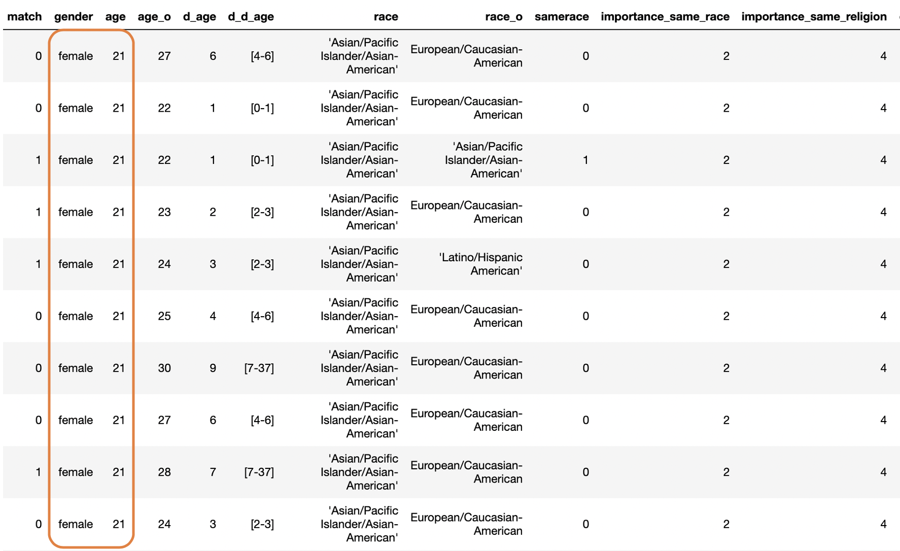

This post excerpt. It contains elements about the content of the posts

There are a lot of data-powered applications and this number is believed to increase for the decades to come. From search engines to recommendations systems, images and videos applications to text understanding applications, etc, data-applications has taken a huge place in the lives of many people. Teams (data scientists, software engineers and subject-matter experts) in charge of building these applications are usually eager to collect any type of data and use them for analysis, prediction models and sometimes sharing (for data science competitions purposes for example). However, breaches have been documented in the past years and have shown the massive collection is not totally harmless to the end-users of this applications.

Existing scientific litterature had proven differential privacy is an effective way to ensure users information protection in machine learning applications. The technique has been pionneered by Cynthia Dwork since the early 2000's and has received a lot of attention in the community ever since. Some of the big players in AI ground (Apple, Google, Microsoft, Samsung) have productionize it to preserve users privacy. This technique can clearly help fill the trust gap between curators and users. **_Applying this idea, I will try to preserve users information in a database using machine learning to analyse and predict._**

### Experimental data

Between 2002-2004, researchers at Columbia Business School [1] collected information form experimental speed dating events. The participants have 4 minutes to chat with every other participant of the opposite sex. The organizers collected many attributes such as match decision(if they want to see the other partner after each 4 four minutes talk) demographics, self-perception attributes, beliefs, attractiveness, sincerity, ambition, intelligence, fun, etc. The **_"match"_** variable is the target variable.

For each participant, it is reported the interactions features with other participants and the

<i>Fig 1: Dataset used in the experimentation</i>

So for this dataset, the first indiviudal (who is a female) have interactions with 10 males. She is 21 and she accepted to meet (target variable match) 4 out of the 10 males, after the speed dating events. She is an asian american and has met with 8 caucasian american, 1 asian american and 1 hispanic american.

The data is taken from [OpenML](https://www.openml.org/) and can be access [here](https://www.openml.org/d/40536)

### Differential Privacy in a nutshell

Differential Privacy (DP) is a mechanism designed to protect information of individuals through a randomized process. Concretely, it introduces noise into the data in order to retain information from an attacker (any individual who might want to access information that is not intended to be disclosed). There exists two forms of DP:

- the (global) DP in which data is collected from every individuals and aggregated into a single database (or server); the noise is then introduced in an aggregated result of the collected data before publishing.
- the Local Differential Privacy (LDP) in which the noise is introduced in every individual data before centralization by the aggregator. This setting brings stronger privacy guarantees than the previous one as individuals do not have to trust the aggregator. But the cost of applying LDP form is to have a huge dataset so we can average out the local noises added to each individual-level information.

The promise of DP is to ensure the plausible deniability of any user's information who shares his/her data. This means, the results of a data analysis will not change if any individual from the database decide to opt out from the database.

For any database, we need to quantify the amount of privacy we spread into the data. Here comes the notion of **_privacy budget_**.

  <input type="range" id="epsilon" name="epsilon"
         min="0" max="11"/>
  <label for="epsilon">Epsilon</label>

For an introduction to the concept of DP, please take a look at [my first](https://medium.com/@capgemini.invent.europe/differential-privacy-embedding-privacy-into-data-usage-f827f620f886) post on the subject.

### Learning privately from the data

As a first step, I will build a classification model to determine who will probably match in the future, based on the data I have. I decided to go for neural nets build with Tensorflow/Keras.

The model architecture is show below:

### Future directions

### References

1. Raymond Fisman, Sheena S. Iyengar, Emir Kamenica, Itamar Simonson [Gender Differences in Mate Selection: Evidence From a Speed Dating Experiment](https://doi.org/10.1162/qjec.2006.121.2.673), The Quarterly Journal of Economics, Volume 121, Issue 2, 1 May 2006, Pages 673–697
2.
3.
4.
5. this massive data usage is not totally harmless for the end-users.
   A well known statistic informs us that one-third of US populations can be fully retrieved using the ZIP code, date of birth and ... This simply means, people's informations cannot feel priv
   Machine Learning applications collect and operate on a broad range of data. In a need to be collecting data, these applications These data can be sensitive in many cases (such as medical data or dating) and can be potentially harmful to individuals if revealed widely. The increasing need for individual data protection
