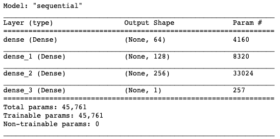

Data-powered applications are the essence of the AI era, and the number of these apps is believed to increase for the decades to come. From search engines to recommendations systems, images and videos applications to text understanding applications, etc, data-apps have taken a huge place in the lives of many people. Teams (data scientists, software engineers and subject-matter experts) in charge of building these apps are usually eager to collect any type of data and use them for analysis, prediction models and sometimes sharing (for data science competitions purposes for example). However, breaches and data leakages have been documented in the past years and have shown the intensive data collection is not totally harmless to the end-users of these apps.

Existing scientific litterature had proven differential privacy to be an effective way to ensure users's privacy in data collection and/or machine learning analysis. The technique has been pionneered by Cynthia Dwork since the early 2000's and has received a lot of attention in the community ever since. Some of the big players in AI ground (Apple, Google, Microsoft, Samsung) have productionize it to preserve users privacy. This technique can clearly help fill the trust gap between curators and users. **_Applying this idea, I will try to preserve users information in a database while building machine learning model._**

### Experimental data

Between 2002-2004, researchers at Columbia Business School [1] collected information from experimental speed dating events. The participants have 4 minutes to chat with every other participant of the opposite sex (we are quite far from the **Tinder-world** we know now 😅). The organizers collected many attributes such as match decision(if they want to see the other partner after the 4 four minutes talk), demographics, self-perception attributes, other perception attributes, beliefs, attractiveness, sincerity, ambition, intelligence, fun, etc. The **_"match"_** variable is the target variable.

<i>Fig 1: Experimental dataset</i>

So for this exceprt of the dataset, the first indiviudal (who is a female) have interactions with 10 males during the speed dating events. She is 21 and she has accepted to meet (target variable ***match***) 4 out of the 10 males, after the events. She is an asian american and has met with 8 caucasian american, 1 asian american and 1 hispanic american.

The data is taken from [OpenML](https://www.openml.org/) and can be access [here](https://www.openml.org/d/40536)

The dataset has 8370 rows for 123 columns. There are 1380 matches meaning 16.5% of the total dataset. Out of the 123 columns, there are a lot of *duplicate* columns, i.e the discretized version of each column. For example, from the *Fig 1* above, the 4th column is the difference of the age between the age of a female participant and a male participant that she has met during the event. The 5th column reprsent the discretized version of this difference. I decided to drop all of the discetized versions of columns. It then remains only 64 columns in the whole dataset.

### Differential Privacy in a nutshell

Differential Privacy (DP) is a mechanism designed to protect information of individuals through a randomized process. Concretely, it introduces noise into the data in order to retain information from an attacker (any individual who might want to access information that is not intended to be disclosed).

The promise of DP is to ensure the plausible deniability of any user's information who shares his/her data. This means, the results of a data analysis will not change if any individual from the database have not been part of the dataset. For an introduction to the concept of DP, please take a look at [my first post](https://medium.com/@capgemini.invent.europe/differential-privacy-embedding-privacy-into-data-usage-f827f620f886) on the subject. There exists two forms of DP:

- the (global) DP in which data is collected from every individuals and centralized into a single database (or server); the noise is then introduced in an aggregated result of a query, of the centralized data before publishing.
- the Local Differential Privacy (LDP) in which every individual sends a noisy data and holds the true data on their devices. The noisy data is centralized by the aggregator. This setting brings stronger privacy guarantees than the previous one as individuals do not have to trust the aggregator. The cost of applying LDP instead of the glovbal DP is to have a huge dataset so we can average out the local noises added to each individual-level information.

For more advanced tasks such as modelization, there is a need to have a DP mechanism enforced into the algorithms. It has been demonstrated that some machine learning models especially deep learning models have the ability to memorized part of the training data. By a reverse-engineered process, one can recover the individuals' data from a deployed deep learning model. Here comes the notion of **privacy preserving machine learning (PPML)** that achieves a certain level of privacy within machine learning algorithms.

One such approach of enforcing privacy into an advanced machine learning algorithm is **DP-SGD (Differentially Private Stochastic Gradient Descent)** designed by Abadi et al [2].

### Main principle of DP-SGD

SGD is a core technique in deep learning algorithms. It is an optimization procedure where at each iteration the error between the model's predictions and the true labels is computed on a sample batch of the data; this error is computed on the derivatives (gradients) of each parameters and the parameters are updated in order to close the gap the true labels and the model's predictions . For a more understanding on the gradient descent, please see this [post](https://ruder.io/optimizing-gradient-descent/) [3].

  

    <h3>
    <i>
    The basic idea behind DP-SGD is to control the influence of 
    each training example during the training process
    </i>
    </h3>
  

<h2></h2>
DP-SGD brings two modifications to the classical SGD:

- gradients clipping : at each iteration, each individual gradient's _l2 norm_ is clipped by a value C; that is if the _l2 norm_ &le; C, we keep the gradients, and if the _l2 norm_ is &gt; C we scale it down by a factor of _l2 norm_ divided by C. Gradients' clipping is a very well know technique in deep learning community
- gradients random noise : a gaussian noise is sampled and added to every clipped gradients; this ensures the deniability of any individual in the training set as an adversary who has information about the model's parameters cannot recover any training data point.

In an <a href="http://benocharlo.com/posts/pate_dp_sgd/" target="_blank">upcoming post</a>, I will explain in detail two PPML techniques : DP-SGD and PATE. Now let's move on to our formal modelisation.

### Baseline Model

As a first step, I will build a classification model to determine the probability of a future match, based on the speed-dating data. I decided to go for neural nets using Tensorflow/Keras. I have made a two-step train/test split of the dataset. The frist step is an 70-30% division of the dataset. The second step is a split of the 70% part into 80-20% part each. This way, we have a train-validation-test sets for our modelization. Classical!

The size of the datasets are :

| Train | Validation | Test |
|:------:|:----------:|:-----:|
|4691   | 1173      |2514  |

The basic model I have built is a simple neural network with 3 dense hidden layers (64, 128 and 256 neurons) and 1 sigmoid activation layer as the output. A simple summary of the model:

<i>Fig 2: Model summary</i>

The performances (accuracy metric) of the model on the three datasets are given below:

| Train | Validation | Test |
|:------:|:----------:|:-----:|
|83.42%   | 83.89%      |83.57% |

The model's accuracy is quite stable on the the 3 datasets.

### Learning privately from the data

Abadi et al, have designed a set of hyperparameters that can be tuned for learning privately using DP-SGD:

- *l2\_norm\_clip*: this is the clipping factor that we have talked about earlier. Any gradient is not allowed to exceed a proportion of this factor.
- *noise\_multiplier* : this parameter is the level of noise we add to each clipped gradient. The more noise we add to the gradients, the more private and the lesser accurate the model is.
- *microbatches* : for a more private learning, the gradients should be clipped one by one. But this implies a computational overhead. A solution to reduce the computational overhead is to increase the size of microbatches, meaning grouping more gradients and clipping the averaged gradient. The authors of the DP-SGD have designed the bacth size to be evenly divided by the *microbatches*.
- *learning\_rate* : this is the usual udpate parameter in SGD method. A lower learning rate helps converge but the training process is slower.

To implement the private learning, I have used (well, you guessed it 😉) [tensorflow-privacy](https://github.com/tensorflow/privacy).

The values of the previous hyperparameters are:

| Hyperparameters | Values |
|------|:----------:|
|*l2\_norm\_clip* | 1.5  |
|*noise\_multiplier* | 0.8  |
|*microbatches* | 8 |
|*learning\_rate* | 0.25|

The *microbatches* hyperparameter is designed to be a multiplie of the *batch_size*. One thing quite strange in the implementation of the package is that the datasets need to have a number of rows, also multiple of the *microbatches*. Hence, we need to downsize the training set from 4691 to 4688, the validation size from 1173 to 1168 and the test size from 2514 to 2512.

After running the model using DPGradientGaussianOptimizer, we have the following performances:

| Train | Validation | Test |
|:------:|:----------:|:-----:|
|83.43%  | 83.90%   |83.37% |

### Measuring the privacy guarantee

After building the differential privacy model, one's need to assess the level of privacy incurred by the private learning to enable comparison. This level of privacy measures also how much an adversary can improve its knowledge about a single poinnt in the dataset by observing the outcome of the training procedure. This is called the **privacy budget**.

An understanding of the **privacy budget** is given in Nicolas Papernot's blog. A lower privacy budget incurs a stronger privacy([4]):

  

    <h3>
    <i>
     Intuitively, this is because it is harder for a single training point to affect the outcome of learning: for instance, the information contained in the training point cannot be memorized by the ML algorithm and the privacy of the individual who contributed this training point to the dataset is preserved.
    </i>
    </h3>
  

<h2></h2>

In tensorflow implementation of DP, the Rényi-DP is used to measure the privacy budget. In our example, the privacy budget is 1.03; which is the upper bound probability of the how much a model can vary by including or excluding a single training point.

### References

1. Raymond Fisman, Sheena S. Iyengar, Emir Kamenica, Itamar Simonson [_Gender Differences in Mate Selection: Evidence From a Speed Dating Experiment_](https://doi.org/10.1162/qjec.2006.121.2.673), The Quarterly Journal of Economics, Volume 121, Issue 2, 1 May 2006, Pages 673–697
2. Martin Abadi, Andy Chu, Ian Goodfellow, H. Brendan McMahan, Ilya Mironov, Kunal Talwar, Li Zhang [_Differential Private Deep Learning_](https://arxiv.org/pdf/1607.00133.pdf)
3. Sebastian Ruder, [_An overview of gradient descent optimization algorithms_](https://ruder.io/optimizing-gradient-descent/)
4. Nicolas Papaernot, [_Machine Learning with Differential Privacy in TensorFlow_](http://www.cleverhans.io/privacy/2019/03/26/machine-learning-with-differential-privacy-in-tensorflow.html)
