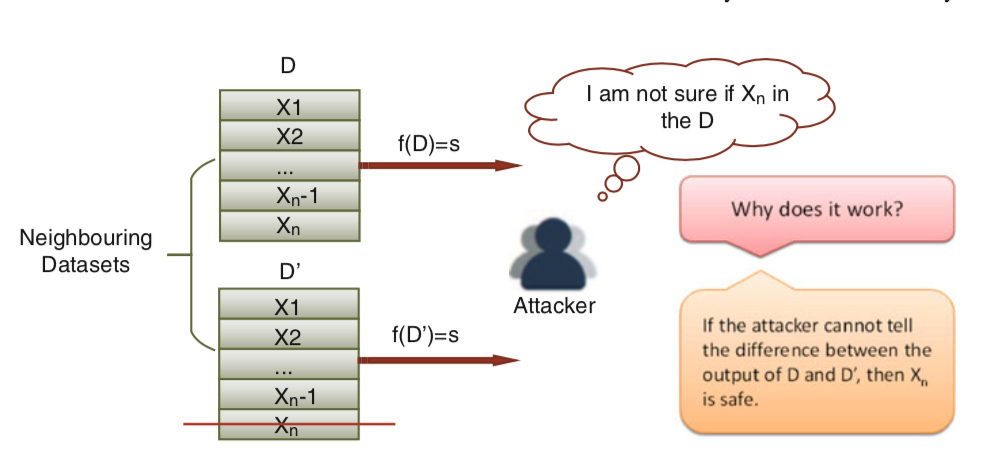
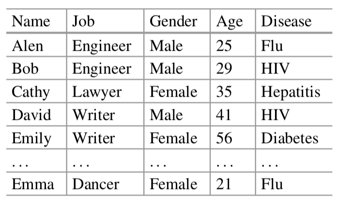
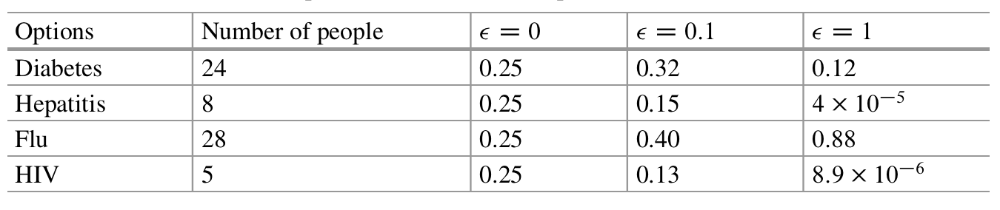
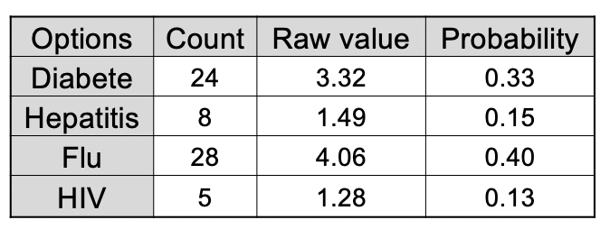
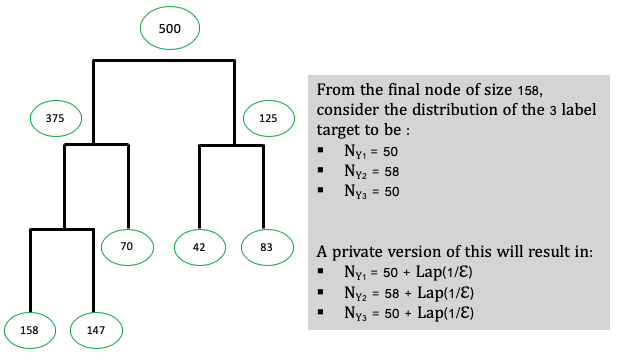

*[This post was originally published on Capgemini Invent Medium](https://medium.com/swlh/differential-privacy-embedding-privacy-into-data-usage-f827f620f886)*. Many thanks to [Cyprien Henry](https://www.linkedin.com/in/cyprienhenry/?originalSubdomain=fr) for the review.

Data is considered to be the "black gold" of the 21st century. It is everywhere, it comes from multiple sources and it is stored consistently. It has become part of companies's DNA and is key to their strategies. Governments and organizations are not left out of this mass data collection and analysis.

Though, this has been very valuable to data collectors (_curators_), data collection may not be totally harmless for individuals who see their personal information gathered and analysed. In fact, some datasets contain private and sensitve information. Privacy violation may occur and individual information can be revealed either in data collection stage itself or in data analysis stage. These violations are severely condemned with the enforcing of GDPR in EU since May 2018 for example. While we might understand companies need to have a competitive advantage with the extensive use of customers data to improve their products and services, the protection of people information is also an understandable point.

**Privacy by Design**, which is the idea that IT systems should embed more privacy algorithms and techniques as early as possible from their design, is becoming a reality. Apple's iphones, Google's browser Chrome, Microsoft are some of the huge players that have implemented privacy into their products to protect customer's personal data while keep generating business insights from this data.

Before getting into a privacy mechanism, we need to have a look to some privacy violations cases.

## Examples of privacy violations

Many examples of data privacy violations can be found in the litterature and in the news.

About 3 years ago, [Bose Corporation has been sued ](https://www.itnews.com.au/news/bose-sued-over-alleged-privacy-breach-458877) for allegedly using an app that track their customers music, podcasts and other audio they listen to, through their wireless headphones.

The french Journal "Les Echos" on his November 21st, 2019 appearance has reported that a subsidiary company of Accor Hotels has been hacked. Historical sentive data such as hotel and transportation booking, billings and some partial informations of credit card of more than 130 000 customers have been leaked. The company has reported this event to CNIL which is the french government Data Protection Commissionner who fines the company. CNIL in the exercice of his duties has fined other companies such as Bouygues Telecom, Uber or Hotel Mariott for exposing customers personal data.

Everyone may remember what is coined in 2014 as the [largest cybersecurity breach](https://money.cnn.com/2016/09/22/technology/yahoo-data-breach/) ever. Data associated with more than 500 millions Yahoo's users has been stolen as part of a massive attack on Yahoo's network.

In addition to this privacy violations examples, we also have the well-known de-anonymization of medical dataset by Latanya and Netflix data science competition case.

Latanya Sweeney has linked voter registration to an anonymized medical dataset and easily re-identify people from the anonymized dataset. According to her, 87% of US population can identified through the ZIP code, date of birth and gender [1].

Netflix released an anonymized dataset as part of huge competition for data scientists. Using other open online datasets such the IMDb, anonymized users where identified easily and their personal information of movies preferences were revealed [2].

As the above cases are not isolated, there is a huge harm for personal data stored, whether this harm comes from the data collector herself (the company) or from an external individual or organization (an attacker).

## Privacy-preserving mechanism

There are numerous techniques designed to help ensure privacy in data. A state-of-the-art and sexy technique in this particular field is the **Differential Privacy** (or its variant **Local Differential Privacy**).

Consider you were asked to take part of a study in social sciences to know about whether you have a particular embarrassing or compromising characteristic P. To report your answer,

- you were first asked to flip a coin
- if it comes up tails, then respond truthfully
- if heads, then flip a second coin and respond _"Yes"_ if it is heads and _"No"_ if it comes up tails

This is called a **randomized process**. It ensures you the **plausible deniability** of your answer. Even if, your answer is _"Yes"_, it doesn't necessarily mean that you have the embarassing characteristic P. This process can be seen simply as a formal definition of privacy embedded in data collection.

In the **_privacy book_** by Cynthia Dwork and Aaron Roth [3], the promise of Differential Privacy (DP) is simple:

  

    <h3>
    <i>
    You will not be affected, adversely or otherwise by allowing your data to be used in any study or analysis no matter what other studies, datasets or informations sources are available
    </i>
    </h3>
  

<h2></h2>
    
From an attacker viewpoint, DP is resisting information leakage in a way that it only provides a noisy aggregated information of individuals in a dataset. For a dataset of n individuals, this implies DP will not reveal the information of the last individual if an attacker holds the n-1 individuals information.

<i>Fig 1 : Concept of Differential Privacy from [4]</i>

The mechanism which yields this aggregated result is said to be **differentially private**.

So, mathematically speaking, let D and D' be two neighboring datasets such as D' has all individuals information in D but one less individual information (that is in D), let M be a randomized process and S the set of output. The mechanism M is &epsilon;-differentially private if :

 \in S ] \leq exp(\epsilon) * Pr[M(D') \in S])

The factor &epsilon; is called the **privacy budget**. This privacy budget defines the level of privacy embedded in the mechanism M. The more private the mechanism, the smaller &epsilon;.

How can one then design the mechnanism M in order to protect the individuals information in a dataset?

When a user sends a query to a database, the answer of the query is computed through a function _f_. Before reporting this answer to the user, a noise is added to this function. This noise can be drawn from many probabilistic distributions such as the **_Laplace distribution_**. The Laplace mechanism is suitable for numeric queries and the Exponential mechanism is used for non-numeric queries [4].

Before going to the formal definition, we need to know about what is called the **sensitivity**. The sensitivity of a query  function is the amount by which a single individual's information can change the query function. If you recall the neighboring datasets from above, the sensitivity of a mechanism on a _count_ query is 1. That is, when we remove only one individual from the database, the result to the _count query_ differs.

Then, the formal definition of a Laplace mechanism is:

 = f(D) + Lap(\frac{\Delta f}{\epsilon}))

&Delta; is the sensitivity of the query _f_

The Exponential mechanism is written :

 = { output \ r \ with \ probability \ \propto \exp(\frac{\epsilon * f(D,r)}{2* \Delta f}) })

_r_ is the result of the query, i.e the output class for a categorical variable example

_f_ is the chosen scoring function

Considering this medical record dataset, in which we have informations of patients from a district.

<i>Table 1 : Illustration from [4]</i>

For instance, if we send a query : _"what is the most common disease in the district"_, we will first compute the count function of all diseases, then pick the highest one.

When someone new settle down in the district and has his or her medical record saved, by sending the same query, we will be able to know whether that person has diabete or not for example.

But if we apply an exponential mechanism to this query, we will get the following table:

<i>Table 2 : Differents privacy budget for the query from [4]</i>

First we can notice whatever privacy budget we choose, we never get the strictly exact result.

We have a much different result from the privacy budget we chose. When &epsilon; is very 0, the probabilities are the same, which means the privacy constraint is too strong. When &epsilon; is very high (equal to 1), the privacy constraint is too weak to render the fair reality. A quite fair reality is rendered when we set &epsilon; to 0.1 as this gives us the nearly true frequencies. And this protects personal informations of patients in the database.

The calculation of the values in the previous table is shown (in case ) below:

<i>Table 3 : Exponential mechanism details</i>

where :

)

In this case, 

### A GLIMPSE INTO LOCAL DIFFERENTIAL PRIVACY (LDP)

Differential Privacy as we outlined it above, requires users to send their data to an aggregator. This former will have to noise the data before any publishing or analysis. This implies users have **to trust** the data aggregator.

In the Local Differential Privacy, users perturb their own data before sending it to the data aggregator [4]. On modern smart devices, this is done by implementing the noise into the user's devices; the collected data is already prone to plausible deniability from the users.

This variant brings more strong guarantees on user's data without the need of a third party. For a complete and simple introduction to LDP, more informations in [5, 6]. LDP is accepted in the community as the main way of embedding privacy for users' data. For example Google Randomized Aggregatable Privacy-Preserving Ordinal Response (RAPPOR) is such an implementation of LDP. RAPPOR has been developped for Google Chrome web browser.

## DIFFERENTIAL PRIVACY IN MACHINE LEARNING

Let's now look into how one can implement a machine learning algorithm while ensuring privacy.

Let's consider a simple machine learning algorithm, the basic decision tree. Geetha Jagannathan et al [7] have proposed to build a differentially private classifier, not from a simple decision tree but random decision trees which they have shown to prove good results for small datasets. The steps to build this algortihm:

- _N_ is the total number of trees to be constructed
- For every tree , split the data in multiple random partitions
- Within every final node of the tree, add a laplacian noise to the count of samples for each value of the label.

<i>Fig 2 : Illustration of DP in tree construction</i>

- To predict a new sample, first make an inference of the decision trees onto the new sample, collect all the partitions from all _N_ trees where the sample appears, sums the count of each label from the collected partitions and computes the probabilities of the sample to belong to either class.

As for Deep Learning methods, the work by Martin Abadi et al ([6]) show how privacy can be ensured while training a neural network. They have (re)designed the Stochastic Gradient Descent algorithm and the hyperparameters tuning under a privacy budget constraint. This privacy constraint has been implemented in [Tensorflow](github.com/tensorflow/models) and is now a complete new feature in Tensorflow 2.0 with the [privacy module](https://github.com/tensorflow/privacy)

## Conclusion

Digitalisation has eased data collection from group of people, especially through modern devices. The request for more privacy in the usage or collection of data is at its peak. Many privacy violations had weaken trust between customers and companies.

(Local) Differential Privacy which is a technique that perturb the data to ensure a plausible deniability from users while carrying out a meaningful analysis from data.

At the time of this article's publication, there is an ongoing debate in using a mobile app to track people who are asymptomatic of COVID-19 in order to protect life and economy. The concern is the level of privacy this app could embed as it will track people in their geolocation nearly all the time. Using (L)DP can be an effective way to ensure privacy in such app and grant an easy acceptation of the geolocation by people.

The privacy field is getting a lot of attention and the community is evolving. Such methods may be widely considered to protect more people.

## References

[1]: Latanya Sweeney, [_k-anonymity: a model for protecting privacy_](https://epic.org/privacy/reidentification/Sweeney_Article.pdf)

[2]: Arvind Narayanan and Vitaly Shmatikov, [_Robust De-anonymization of Large Sparse Datasets_](https://www.cs.utexas.edu/~shmat/shmat_oak08netflix.pdf)

[3]: C. Dwork and A. Roth. [_The Algorithmic Foundations of Differential Privacy_. Foundations and Trends® in Theoretical Computer Science, vol. 9, nos. 3–4, pp. 211–407, 2014](https://www.cis.upenn.edu/~aaroth/Papers/privacybook.pdf)

[4]: Tianquing Zhu, Gang li, Wanlei Zhou, Phillip Yu [_Differential Privacy and Applications_](https://www.springer.com/gp/book/9783319620022)

[5]: Graham Cormode, Somesh Jha, Tejas Kulkarni, Ninghui Li, Divesh Srivastava, and Tianhao Wang. 2018. [_Privacy at Scale: Local Differential Privacy in Practice. In SIGMOD’18: 2018 International Conference on Management of Data, June 10–15, 2018, Houston, TX, USA. ACM, New York, NY, USA, 4 pages_](https://doi.org/10.1145/3183713.3197390)

[6]: Björn Bebensee, [_Local Differential Privacy : a tutorial_](https://arxiv.org/pdf/1907.11908.pdf)

[7]: Geetha Jagannathan, Krishnan Pillaipakkamnatt, Rebecca N. Wright, [_A Practical Differentially Private Random
Decision Tree Classifier_](https://columbia.github.io/private-systems-class/papers/Jagannathan2012APractical.pdf)
