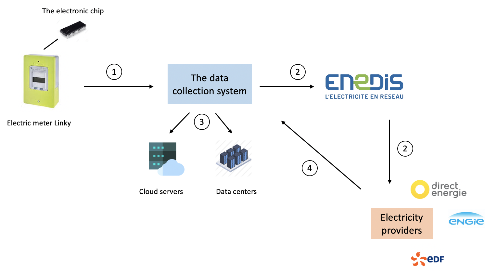

The OpenMined Community launched in January 2021 the Private AI Series. The series are a set of courses to democratize the use of privacy enhancing technologies to a technical audience as well as to a non-technical one. In this project, I will describe a service that can leverage the use of privacy technologies to enable a wide adoption.

In France, smart electric meters named Compteur Linky were introduced in year 2015. These new-generation electric meters were developed in a need of modernization of the electrical network. Enedis, the company in charge of the installation has targeted a 90% adoption by the end of 2021 in every households. The main advantage of this electric meter is the easy electric charge curve collection.

Nonetheless, these smart electric meters are heavily rejected by many households. People throughout many department and municipalities in France have filed court actions against Enedis. Spying, non-respect of people privacy, bill increasing, Enedis’ agents trespassing properties for installations are some of the reasons of the legal actions against Linky.

In this project, I will describe a new smart electric meter using privacy-enhancing technologies in an effort to bring more privacy to the data collection process and build more trust to the end customers.

## PRODUCT DESCRIPTION

The main objective of smart electric meters is the collection of electric charge curve. This type of data enables the monitoring of level of electric consumption in a household. By using this kind of data, data collectors can easily infer the presence of absence of people at their houses, the type of machines used in the houses and the electrical consumption habits of households. This kind of personal data can be sensitive in some cases and revealing them can endanger the privacy and the lives of the data generators.

I envisioned the embedding of a chip in the electric meter, the same kind of chip that allow computing on mobile phones. This chip will replace the current collecting chip. This is proposed in a way to not alter the whole electric meter. The chip will interact with a platform before routing a version of the data to the energy providers that is in charge of measuring the level of electrical consumption. The value of such is system can be seen in two ways. The first is that the system enables household’s energy consumptions data private. The second is that the platform can be owned by collectivities or cities and alleviates energy providers need of data storage. The figure below shows the functioning of the chip and the transit of data.

 

<i>Fig 1 : Data transit from households to energy providers</i>

This is a showcase of an information flow from household to electricity providers and back from providers to households. This information flow needs to be carried in a secure and private way.

## DATA TRANSIT WITH PRIVACY TECHNOLOGIES

The input data of the system is of course socio-demographic data of the households like number of people living in the households, age of each member, number of people working etc. The very next input data is the electrical curve charge at a fine-grained level (like of every 15 minutes).

1 - This input data can be encrypted to provide more privacy to end customers. The secure electronic chip will be delivered with a public and private key for every household. The keys can be linked to people identities in the household in case of moving to another places. The input data will then be homomorphically encrypted.

2 – The second is a classical one of making the data available to energy provider. As there are millions of households using the smart meters, local differential privacy can be used to noise the data before encryption with a certain privacy budget. The storing will be conducted by a data collection platform. As a reminder differential privacy is a mechanism which the results of calculation/aggregation remain unchanged with a certain level of probability whether or not a particular individual data is for the calculation.

3 - As this homomorphically encrypted data can be really heavy for the providers, I imagine a data collection system (like BrainCube startup does for industries). The encrypted data will be then stored securely on cloud servers and data centers. This a case where encryption can ease the adoption of clouds. 

4 - The stored data can be requested by any energy providers for bill calculation for a households, neighborhoods, departments and regions. The bill amount will be sent back to the platform as an encrypted valued. And only the households chip have the private key to decrypt this amount of the bill.
